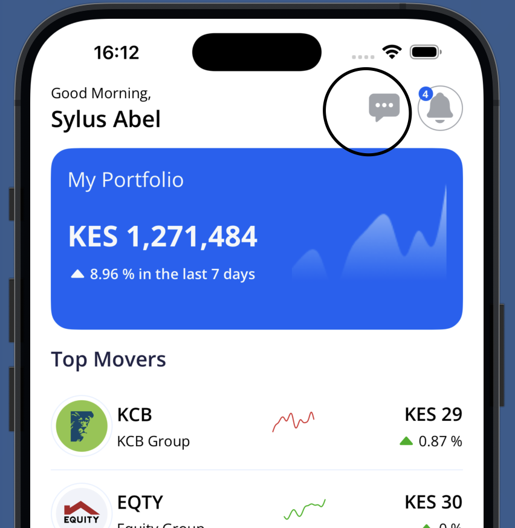
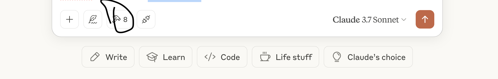

# NEO - 0.0.5913311

## Key Details

1. Neo Agent Account -> [0.0.5913311](https://hashscan.io/testnet/account/0.0.5913311?pa=1&ps=1&pf=1&pc=1&ph=1&pt=1&pn=1&pr=1&p1=1&k1=1745735450.778853656)
1. Mock USDC token -> [0.0.5791936](https://hashscan.io/testnet/token/0.0.5791936)
1. Sample topic with test user account -> [here](https://hashscan.io/testnet/transaction/1745327765.775018000)

## Building Application

### Option 1 via React Native Client

1. Clone this repo: `git clone https://github.com/divin3circle/neo.git`
1. At the root build the MCP server and run the client: `npm run build && npm run mcp-server`
1. Clone the NSEChain App: `git clone https://github.com/divin3circle/NSEChainBridge.git`
1. Run the backend: `cd backend && npm run build && NODE_ENV=testnet PORT=5004 node dist/index.js`
1. Run the frontend: `npx expo run:ios #use android if you're on windows and have Android studio`
1. Authentication details: `username: Sylus Abel, email: sa44@example.com, password: sam@2002`
1. Navigate to the chat section and begin your conversation with Neo.
   

### Option 2 via Claude Desktop(Recommended)

_Docker is required for this step, ensure that the Docker Desktop app is also open and running_

1. Follow step 1 - 4 above.
1. Add neo to the Claude desktop's config.json file. Check [this](https://modelcontextprotocol.io/quickstart/server#node)
1. Add brave_search and brave_local_search servers to the config file as well. Check [this](https://pub.spillwave.com/mcp-integration-how-brave-search-and-claude-desktop-enhance-ai-assistant-agentic-capabilities-c840590fa100)
1. You should see 8 tools available.
   
1. Provide these credentials to call any tool.

```bash
email: sa44@example.com

username: Sylus Abel

password: sam@2002

privateKey: 302e020100300506032b65700422042037bd51ae06cbc9ac1954c0782bc1830559256d63ddc0d6d45e503aa7fde2e3e3

userId: 680f393882aca3762a5ef9eb

Hedera Account ID: 0.0.5917133

Phone number: #Provide an M-pesa eligible mobile number
```

_Learn about [M-Pesa](https://www.investopedia.com/terms/m/mpesa.asp) here_

## Consumptions

To effectively perform rebalancing Neo will uses the following.

### On-Chain Data

- User's token balances
- Token prices
- Historical transactions by the user or rebalancing decisions
- Hashes & real-time historical reads using mirror node apis

### Off-Chain Data

- NSE Shares & Stock prices held by the user
- New around shares and stocks being held by the user or those of interest to him
- M-Pesa transaction info
- User defined constraints

## Actions Logic

### Rebalancing

Neo will perform a portfolio rebalance when one or more of the following conditions/actions are triggered:

1. Portfolio deviates from target allocations or user constraints
1. Market volatility suggest safe diversifications
1. A sentiment shift in the market or news flag a risky holding

The steps for rebalancing is as follows but not restricted to:

- Fetch current portfolio balances from a user's Hedera account and broker portfolio
- Compare the portfolio against user's target allocation or an AI model or both
- Calculate required actions, swap over-presented tokens for USDC or other under-presented tokens
- Estimate fees and slippage
- Prepare and sign the transaction using Hedera Agent Kit with user's prior consent
- Log the rebalancing action into the user-agent or agent-agent private topic

### Minting/Redeeming

Minting of tokens would be against user's deposited fiat or USDC holding within the app. Similarly redeeming would be to USDC or fiat that can be withdrawn to M-pesa by the user.

#### Criteria

Just as the rebalancing logic, Neo will check the user's current holding stocks-wise and token wise, previous logs and their outcomes plus market sentiment and news flags to determine the best action to perform on a token/share in holding by the user.

## Logging & Learning

Each action, i.e. rebalancing, minting or redeeming by Neo will be logged to HCS as a topic, and or saved in a database for learning purposes and review. With these memory Neo can get smarter without the need to train while adapting to a user's specific habits, appetite and the market it finds itself in.
The goal is to have Neo capable of executing transactions on the blockchain, able to justify decision and learn from old mistakes to continuously improve.

Neo creates a topic with the HIP 991 standard, with a custom fee of 0.1 USDC(now they user has a reason to deposit USDC via M-Pesa). Each user prompts is treated a message subscription paid to the AI agent. The communication is done over HCS-10.
